# GitHub Insights Examples

Generated for [@urmzd](https://github.com/urmzd) using `../urmzd/github-insights.yml`.

Last generated: 2026-07-15

| Preset | Preview | Sections |
|--------|---------|----------|
| [Showcase](./showcase/README.md) |  | spotlight, velocity, rhythm, constellation, portfolio, impact |
| [Ecosystem](./ecosystem/README.md) |  | spotlight, velocity, rhythm, stack, portfolio, impact |
| [Modern](./modern/README.md) |  | spotlight, velocity, rhythm, constellation, impact |
| [Classic](./classic/README.md) |  | velocity, rhythm, constellation, impact |
| [Minimal](./minimal/README.md) |  | velocity, rhythm |
