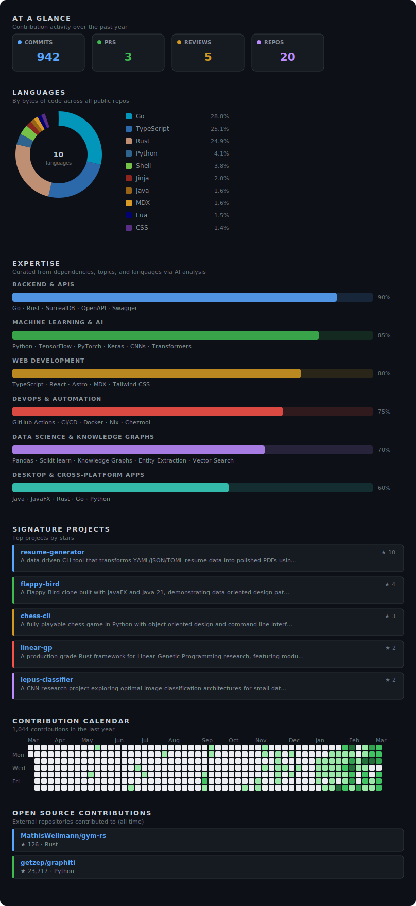

# Urmzd Mukhammadnaim

I'm Urmzd Mukhammadnaim, based in Austin, TX, building systems to empower people using Rust, Go, TypeScript, and Python. My work spans backend engineering, machine learning, web development, and DevOps, with a strong focus on robust, scalable solutions.

My primary expertise is in backend/API design (Go, Rust, SurrealDB, OpenAPI), machine learning (Python, TensorFlow, PyTorch), and modern web development (TypeScript, React, Astro). I actively develop projects like **resume-generator**—a multi-language CLI for generating resumes from structured data, **homai**—a distributed sunrise simulation system with Zigbee and AWS integration, and **linear-gp**—a Rust framework for genetic programming research. These projects combine deep domain knowledge, diverse tech stacks, and large codebases, representing my most technically ambitious current work.

Other active repositories include my personal site (**urmzd.com**), privacy-first AI agent (**zoro**), modern dotfiles with Nix and Chezmoi, and tools for OpenAPI code generation, language learning, and semantic release automation. I regularly contribute to open source, with nearly a thousand commits last year, and enjoy exploring new ways to connect systems, data, and people.

Notable past projects include **lepus-classifier** (CNN research for image classification), **md-classifier** (deep learning for medical symptom classification), and **flappy-bird** (cross-platform desktop game in JavaFX), each demonstrating engineering depth and cross-disciplinary skills.

  

Last generated on 2026-03-14 using [@urmzd/github-metrics](https://github.com/urmzd/github-metrics)
