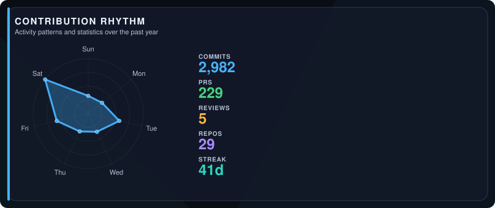

<!-- ai-metadata
type: github-profile
name: Urmzd Mukhammadnaim
username: urmzd
title: AI Engineer
languages: [Rust, Go, TypeScript, Python, Java, Lua, Astro, Ruby, Go Template, JavaScript]
profile: https://github.com/urmzd
-->

# Urmzd Mukhammadnaim

I design scalable AI workflows from scratch, focusing on streaming agent SDKs and modular memory systems. Projects like saige and mnemonist show how I use Go and Rust to build unified tools for graph-based knowledge and seamless agent integration.

<!-- section: social -->
  

<!-- section: velocity -->
## Language Velocity

<picture>
  <source media="(prefers-color-scheme: light)" srcset="./metrics-velocity-light.svg">
  
</picture>

<!-- section: rhythm -->
## Contribution Rhythm

<picture>
  <source media="(prefers-color-scheme: light)" srcset="./metrics-rhythm-light.svg">
  
</picture>

<!-- section: constellation -->
## Project Map

<picture>
  <source media="(prefers-color-scheme: light)" srcset="./metrics-constellation-light.svg">
  
</picture>

<!-- section: impact -->
## Open Source Impact

<picture>
  <source media="(prefers-color-scheme: light)" srcset="./metrics-impact-light.svg">
  
</picture>

<!-- section: footer -->
Last generated on 2026-07-15 using [@urmzd/github-insights](https://github.com/urmzd/github-insights)
