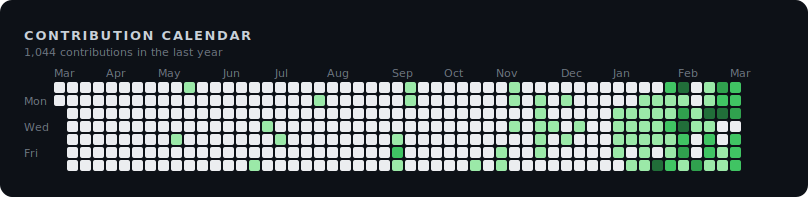
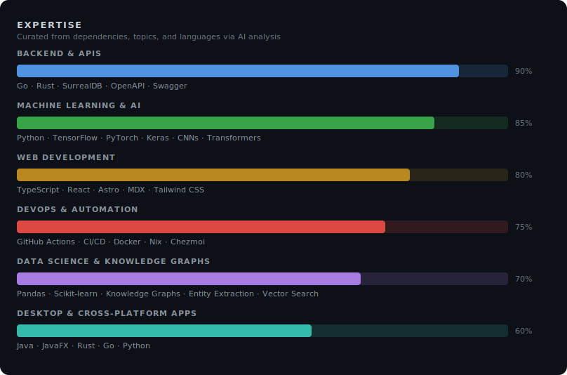

# Hi, I'm Urmzd 👋

I build robust systems and tools in Go, TypeScript, and Rust—ranging from data-driven resume generators and distributed IoT platforms to advanced genetic programming frameworks and privacy-first AI agents. My work focuses on empowering people through automation, backend APIs, and intelligent applications.

  

## Active Projects

- **resume-generator** - A data-driven CLI tool that transforms YAML/JSON/TOML resume data into polished PDFs using LaTeX or HTML templates, enabling rapid generation of customized resumes for different job applications. (10 ★)
- **homai** - An automated distributed light system that simulates sunrise to help users wake naturally, featuring Zigbee smart bulb integration, SMS control, and AWS-based infrastructure for circadian rhythm management.
- **linear-gp** - A production-grade Rust framework for Linear Genetic Programming research, featuring modular architecture, Q-Learning integration, automated hyperparameter optimization, and support for reinforcement learning and classification tasks. (2 ★)
- **urmzd.com** - Personal website and blog built with Astro, TypeScript, and MDX—featuring fast static site generation with interactive components for content and portfolio.
- **dotfiles** - Modern dotfiles with Chezmoi and Nix, providing one-command environment bootstrap for macOS and Linux—includes Neovim, Tmux, Zsh, and specialized development shells. (2 ★)
- **zoro** - Connect your ideas, privately. Privacy-first AI research agent with a persistent knowledge graph — all inference runs locally.
- **openapi-generator** - OpenAPI 3.x → TypeScript & React code generator. Zero-dependency clients, SWR hooks, and SSE streaming.
- **languide** - A Python CLI that generates practical, scenario-based language learning PDFs with full Unicode/CJK support—covering restaurants, hotels, transportation, and more for travelers and language learners.
- **flappy-bird** - A Flappy Bird clone built with JavaFX and Java 21, demonstrating data-oriented design patterns and cross-platform desktop development with automated native builds for Linux, macOS, and Windows. (4 ★)
- **semantic-release** - Configurable trunk-based semantic release CLI for Rust — conventional commits, changelog generation, git tagging, and GitHub releases
- **chess-cli** - A fully playable chess game in Python with object-oriented design and command-line interface—ideal for learning game logic, exploring chess AI algorithms, or playing from the terminal. (3 ★)
- **embed-src** - A GitHub Action that automatically syncs code snippets in markdown files with source code, keeping documentation fresh during CI/CD and reducing manual update overhead. (1 ★)
- **github-metrics** - GitHub Action that generates SVG visualizations of your GitHub profile metrics
- **adk** - Strongly-typed Go SDK for building streaming LLM agent loops — conversation trees, tool registry, sub-agents, compaction, embeddings, and pluggable providers.
- **gitit** - AI-powered git commands — generates atomic conventional commits, code reviews, branch names, and PR descriptions using Claude or Gemini. Two-tier caching for instant repeat runs.
- **kgdk** - Go SDK for building and querying knowledge graphs — SurrealDB backend, entity extraction pipeline, vector search, and pluggable Graph interface.
- **urmzd** - GitHub profile README

## Legacy Work

- **lepus-classifier** - A CNN research project exploring optimal image classification architectures for small datasets, demonstrating that data quantity remains the fundamental bottleneck for deep learning performance. (2 ★)
- **md-classifier** - A deep learning system combining transformers and CNNs to classify diseases from patient-described symptoms, achieving 90% recall through semantic embeddings and CNN feature extraction. (2 ★)

## GitHub Stats

## Other Areas of Interest

Last generated on 2026-03-14 using [@urmzd/github-metrics](https://github.com/urmzd/github-metrics)
