<!-- ai-metadata
type: github-profile
name: Urmzd Mukhammadnaim
username: urmzd
title: AI Engineer
languages: [Rust, Go, TypeScript, Python, Java, Lua, Astro, Ruby, Go Template, JavaScript]
profile: https://github.com/urmzd
-->

# Urmzd Mukhammadnaim

I design scalable AI workflows from scratch, focusing on streaming agent SDKs and modular memory systems. Projects like saige and mnemonist show how I use Go and Rust to build unified tools for graph-based knowledge and seamless agent integration.

<!-- section: social -->
  

<!-- section: spotlight -->
## Spotlight

### [incipit](https://github.com/urmzd/incipit)
Template-driven CLI for transforming structured resume data into polished PDFs, DOCX, HTML, LaTeX, and Markdown, featuring pluggable templates and multi-agent AI assessment. Built with Go and supports extensive output formats.
Stars: 12 · Languages: Go, HTML, TeX · **Active**

### [saige](https://github.com/urmzd/saige)
Unified Go SDK and CLI for streaming AI agents, knowledge graphs, and RAG pipelines. Designed for scalable AI workflows and graph-based knowledge management.
Stars: 4 · Languages: Go, Go Template · **Active**

### [linear-gp](https://github.com/urmzd/linear-gp)
Production-grade Rust framework for Linear Genetic Programming research, featuring modular architecture, Q-Learning integration, and automated hyperparameter optimization for reinforcement learning and classification tasks.
Stars: 2 · Languages: Rust · **Active**

### [mnemonist](https://github.com/urmzd/mnemonist)
Open ecosystem for tool-agnostic AI agent memory, implemented in Rust and Python. Enables seamless memory integration across diverse AI frameworks.
Stars: 4 · Languages: Rust, Python · **Active**

### [generative-artifact-protocol](https://github.com/urmzd/generative-artifact-protocol)
Open standard for token-efficient artifact updates and streaming, featuring a Rust apply engine and evaluation CLI. Supports multi-language integration for generative workflows.
Stars: 1 · Languages: Rust, TypeScript, Java · **Active**

<!-- section: velocity -->
## Language Velocity

<picture>
  <source media="(prefers-color-scheme: light)" srcset="./metrics-velocity-light.svg">
  
</picture>

<!-- section: rhythm -->
## Contribution Rhythm

<picture>
  <source media="(prefers-color-scheme: light)" srcset="./metrics-rhythm-light.svg">
  
</picture>

<!-- section: constellation -->
## Project Map

<picture>
  <source media="(prefers-color-scheme: light)" srcset="./metrics-constellation-light.svg">
  
</picture>

<!-- section: portfolio -->
## Portfolio

All Projects

### Developer Tools

| Project | Description | Stars | Languages |
|---------|-------------|-------|-----------|
| [teasr](https://github.com/urmzd/teasr) | Rust-based tool for capturing showcase screenshots and GIFs from web apps, desktop, and terminal, delivered as a single binary with no runtime dependencies. | 2 | Rust, HTML |
| [github-insights](https://github.com/urmzd/github-insights) | AI-powered GitHub profile metrics with SVG visualizations, project classification, and README generation. Available as CLI, npm package, and GitHub Action. | 1 | TypeScript, Shell |
| [oag](https://github.com/urmzd/oag) | Fast OpenAPI 3.x code generator for TypeScript, React/SWR, and FastAPI, offering zero runtime dependencies and first-class SSE streaming, implemented in Rust. | - | Rust, Jinja |
| [dispatch](https://github.com/urmzd/dispatch) | Beta control plane for agent execution nodes, enabling deployment and scaling of sandboxed agents with metrics on a shared workspace, built with Go. | - | Go, Shell, Makefile |
| [lazyspeak.nvim](https://github.com/urmzd/lazyspeak.nvim) | Voice-driven coding plugin for Neovim, enabling users to speak their intent and see edits appear in the editor, built with Lua and Rust. | 1 | Lua, Rust, Vim Script |
| [sr](https://github.com/urmzd/sr) | Release engineering CLI in Rust, providing automated semantic versioning from conventional commits as a single static binary with zero runtime dependencies. | - | Rust |
| [agentspec](https://github.com/urmzd/agentspec) | Universal agent skill and sub-agent manager with a terminal user interface, implemented in Rust and Shell. | - | Rust, Shell |
| [zigbee-skill](https://github.com/urmzd/zigbee-skill) | AI-native smart home skill enabling direct control of Zigbee devices by AI agents, with no cloud or hub required, implemented in Go. | - | Go, Shell, Just |
| [dotfiles](https://github.com/urmzd/dotfiles) | Cross-platform dotfiles managed by Chezmoi, supporting Homebrew/apt, per-language version managers, and one-command bootstrap for macOS and Linux with Neovim, Tmux, Zsh, and AI agent skills. | 2 | Shell, Lua, Go Template |
| [fsrc](https://github.com/urmzd/fsrc) | CLI, crate, and GitHub Action for embedding source files into any text file using comment markers, implemented in Rust and Python. | 1 | Rust, Python |
| [urmzd](https://github.com/urmzd/urmzd) | GitHub profile README auto-generating project highlights and activity summaries. | - | - |

### SDKs

| Project | Description | Stars | Languages |
|---------|-------------|-------|-----------|
| [streamsafe](https://github.com/urmzd/streamsafe) | Type-safe async pipeline framework for data processing in Rust, supporting robust and scalable workflows. | - | Rust, Shell, Just |
| [gymnasia](https://github.com/urmzd/gymnasia) | Pure Rust implementation of OpenAI Gymnasium environments, enabling reinforcement learning experimentation without Python dependencies. | 1 | Rust |

### Applications

| Project | Description | Stars | Languages |
|---------|-------------|-------|-----------|
| [urmzd.com](https://github.com/urmzd/urmzd.com) | Personal website, blog, and research portfolio built with Astro, React, and Three.js, showcasing interactive content and technical projects. | 1 | TypeScript, Astro, JavaScript |
| [languide](https://github.com/urmzd/languide) | Scenario-based language guides built from markdown, generating PDFs with full Unicode and CJK support for communication-focused learning. | - | - |

### Research & Experiments

| Project | Description | Stars | Languages |
|---------|-------------|-------|-----------|
| [glassbox-lm](https://github.com/urmzd/glassbox-lm) | Testbed for observable language models where every hidden state is a readable distribution over words, designed for interpretability by construction in Python. | - | Python |

<!-- section: impact -->
## Open Source Impact

<picture>
  <source media="(prefers-color-scheme: light)" srcset="./metrics-impact-light.svg">
  
</picture>

<!-- section: footer -->
Last generated on 2026-07-15 using [@urmzd/github-insights](https://github.com/urmzd/github-insights)
